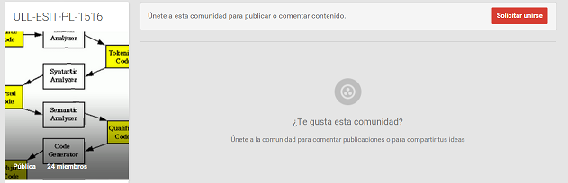
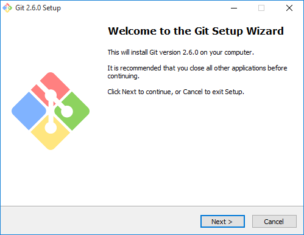
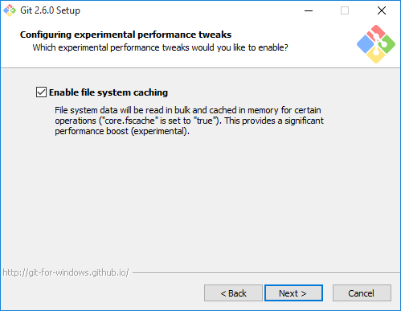

# Tareas Iniciales
#### Autor : MohammedMahrach
#### Credencials : alu0100777475 / alu4543

Configuración de las herramientas y tecnologías a utilizar en la asignatura Procesadores de Lenguajes.

> NodeJS

> Express

> Atom

> GitHub

> Cloud9

> Markdown

## 1. Darse de alta en la comunidad Google + ULL-ESIT-PL-1516
### 1.1. Solicitud de alta

> Desde el enlace  :[*http://mail.ull.edu.es*](http://mail.ull.edu.es)
date de alta en g+ (si no lo has hecho) siguiendo el enlace en +me o +yo en la parte superior derecha



## 2. Instala node.JS
### 2.1. Instalación de Node.js

> Si estás en Windows sigue las instrucciones en GitHub para Windows : [*https://nodejs.org/en/*](https://nodejs.org/en/)


> Si utilizas linux o mac instala via apt-get

    $ sudo apt-get install nodejs

> [Opcional] y recomendado instalar complementos nativos con npm vamos a necesitar instalar las herramientas para compilar:

    $ sudo apt-get install build-essential

### 2.2. Comprueba que npm funciona

> Desde la consola comprobamos si la utilidad de la linea de comandos npm funciona.


## 3. Instala express

> Para instalar express tenemos que tener el npm iniciado.

### 3.1. instalación local a un proyecto :

    $ mkdir myapp
    $ cd myapp
    $ npm init
    $ npm install express --save

> opción --save guarda dependencia en package.json

### 3.2. instalación global

    $ npm install -g express

> la opcion -g para la instalación global

## 4. Pon tu foto en tu perfil del campus virtual


## 5. Instala Git.
### 5.1. GitHub para Windows
> Si estás en Windows sigue las instrucciones en GitHub para Windows : [*https://git-for-windows.github.io*](https://git-for-windows.github.io)

> Descarga e instala el fichero : Git-2.6.0-64-bit.exe

 

 

## 6. Abre una cuenta en GitHub si no la tienes

> Ya tenemos una cuenta publica abierta y esta en el siguiente enlace: [*https://github.com/alu4543*](https://github.com/alu4543)


## 7. Si dispones de un Mac o Windows instala GitHub App
### 7.1. Descargar el instalador

> Desde el siguiente enlace se puede Descargar y instalar GitHub Para Windows Desktop : [*https://desktop.github.com*](https://desktop.github.com)


### 7.2. Configurción


## 8. Instala Atom, el editor desarrollado por GitHub
### 8.1. Descargar el instalador
> Desde el siguiente enlace se puede Descargar y instalar atom Para Windows Desktop.

[*https://atom.io*](https://atom.io)


### 8.2. Prueba

>Ya tenemos el atom instalado!


## 9. cloud9 c9.io

>Abre una cuenta en c9.io (cloud9).


>Vincula tu cuenta de GitHub con c9.

 

## 10. Markdown
### 10.1. Definición


>Markdown es un lenguaje de marcado ligero creado por John Gruber  que trata de conseguir la máxima legibilidad y facilidad de publicación tanto en sus forma de entrada como de salida.
Inspirándose en muchas convenciones existentes para marcar mensajes de correo electrónico usando texto plano.
Markdown convierte el texto marcado en documentos XHTML utlizando html2text creado por Aaron Swartz.
Markdown fue implementado originariamente en Perl por Gruber, pero desde entonces ha sido traducido a multitud de lenguajes de programación, incluyendo PHP, Python, Ruby, Java y Common Lisp.

### 10.2. Pequeño tutorial:

>Saltos de línea: Los saltos de línea se generan cuando se encuentran dos espacios juntos

```
"Quien fue a sevilla,  
perdió su silla"
```

>Encabezados: Los encabezados se generan cuando se encuentra una almohadilla antes de texto

```
# Encabezado h1
## Encabezado h2
### Encabezado h3
...
```

>Citas: Para citar solo es necesario escribir una cuña antes del texto

```
> La vida es muy corta para aprender Alemán. -Tad Marburg
```

>Texto con énfasis: Agregar un asterisco para cursiva y dos para negrita

```
*énfasis* (cursiva)
**énfasis fuerte** (negrita)
```

>Código: Se utiliza el acento grave para identificar código
```
`Código`
```


\`\`\`

Código en
varias líneas

\`\`\`

>Listas:

```
* Un elemento en una lista no ordenada
* Otro elemento en una lista
1. Elemento en una lista enumerada u ordenada.
2. Otro elemento
```

>Enlaces:

```
[Texto del enlace aquí](URL "Título del enlace")
```

>Imágenes:

```

```

## 11. Instalar el traductor pandoc para traducir Markdown a HTML.
>Si necesitas convertir archivos de un formato de marcas a otro, Pandoc es su navaja suiza del ejército.
> mas info : [*http://pandoc.org/*](http://pandoc.org)
### 11.1. Para instalar en Windows:

[*https://github.com/jgm/pandoc/releases/tag/1.15.0.6*](https://github.com/jgm/pandoc/releases/tag/1.15.0.6)


### 11.2. Pandoc Getting started.

[*http://pandoc.org/getting-started.html/*](http://pandoc.org/getting-started.html)

> To convert it to HTML, use this command:

    $ pandoc test1.md -f markdown -t html -s -o test1.html

> To create a LaTeX document, you just need to change the command slightly:

    $ pandoc test1.md -f markdown -t latex -s -o test1.tex

> OR..

    $ pandoc test1.md -s -o test1.tex

> if you want to create a PDF, you’ll need to have LaTeX installed. (See MacTeX on OS X, MiKTeX on Windows, or install the texlive package in linux.) Then do

    $ pandoc test1.md -s -o test1.pdf

### 11.3. Ejemplo :


## 12. Enlace

[Página personal de prácticas](http://alu4543.github.io/)

[Repositorio git de la práctica inicial](https://github.com/alu4543/tareas-iniciales-alu4543)

[Despliegue de la práctica en Github](http://alu4543.github.io/tareas-iniciales-alu4543/)

[Repositorio git de la organización de la práctica inicial](https://github.com/ULL-ESIT-GRADOII-PL/tareas-iniciales-alu4543)

[Despliegue de la práctica en Github de la organización](http://ull-esit-gradoii-pl.github.io/tareas-iniciales-alu4543/)
